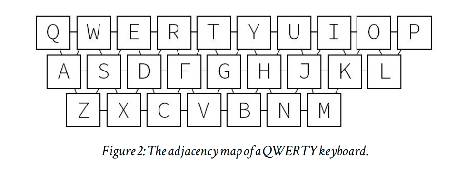

[](https://coveralls.io/github/MighTguY/customized-symspell)
[](https://raw.githubusercontent.com/MighTguY/customized-symspell/master/LICENSE)
[](https://search.maven.org/search?q=g:%22io.github.mightguy%22%20AND%20a:%22symspell-lib%22)
[](https://javadoc.io/doc/io.github.mightguy/symspell-lib)

# Customized SymSpell SpellCheck Java 
**This customized spell check is is based on the spell correction fuzzy search library [SymSpell](https://github.com/wolfgarbe/symspell) with a few customizations and optimizations**  

## Java Ported v6.6 (Bigrams)
* the optional bigram dictionary in order to use sentence level context information for selecting best spelling correction.


## SymSpell
* The Symmetric Delete spelling correction algorithm reduces the complexity of edit candidate generation and dictionary lookup for a given Damerau-Levenshtein distance. 
* It is six orders of magnitude faster (than the standard approach with deletes + transposes + replaces + inserts) and language independent.
* Opposite to other algorithms only deletes are required, no transposes + replaces + inserts. Transposes + replaces + inserts of the input term are transformed into deletes of the dictionary term.
* The speed comes from the inexpensive delete-only edit candidate generation and the pre-calculation.

## Customizations
* We replaced the **Damerau-Levenshtein** implementation with a **weighted Damerau-Levenshtein** implementation: where each operation (delete, insert, swap, replace) can have different edit weights.
* We added some customizing "hooks" that are used to rerank the top-k results (candidate list). The results are then reordered based on a combined proximity
  * added keyboard-distance to get a dynamic replacement weight (since letters close to each other are more likely to be replaced)
  * do some query normalization before search
  
## Keyboard based  Qwerty Distance

we used the adjancey graph of the keyboard for the weights to the connected nodes.


### Example
```
For 2 terms: 
        slices  
        olives

If the misspelled word is, slives 
both slices and olives is 1 edit distnace, 
  so in default case the one with higher frequency will end up in the result.
While with the qwerty based char distance,
 slives is more closer to slices.

The reason for this is in Qwerty Based Keyboard, 
 S and O are too far while V and C are adjacent.
```

## Generation of Deletes

Word deletes are generated with taking edit distance which is minimum of max edit distance and 0.3 * word.length
  
## [Usage](symspell-lib/README.md)

## [Solr Usage](symspell-solr/README.md)

## Accuracy Summary

> Indexed Docs: 3695 

>Searches: 8060

| Spellcorrection Strategy 	| Accuracy 	| Failures 	| TP   	| TN  	| FP  	| FN   	|
|--------------------------	|:--------:	|---------:	|------	|-----	|-----	|------	|
| LUCENE                   	|  78.96%  	|   21.04% 	| 5883 	| 481 	| 146 	| 1550 	|
| Vanilla SymSpell         	|  88.80%  	|   11.20% 	| 6888 	| 269 	| 358 	| 545  	|
| Weighted SymSpell        	|  75.74%  	|   24.26% 	| 5781 	| 324 	| 303 	| 1652 	|
| Qwerty Vanilla SymSpell  	| 88.57%   	| 11.43%   	| 6860 	| 279 	| 348 	| 573  	|
| Qwerty Weighted SymSpell 	| 75.36%   	| 24.64%   	| 5744 	| 330 	| 297 	| 1689 	|

## Benchmark Summary
We have done 3 runs each for 30k and 80k data set, which also includes results for each verbosity level.
After the runs the final benchmarking looks like: 
```
Average Precalculation time instance 30843.33 ms
Average Lookup time instance 138141.09296296295 ns ~ 0.03814 ms
Total Lookup results instance 648092
``` 
[More  Detailed summary](symspell-benchmark/README.md)
  
## Built With

* [Maven]()


## Versioning

We use [SemVer](http://semver.org/) for versioning. 

## Nexus
* [Link to Nexus-Releases](https://oss.sonatype.org/service/local/repositories/releases/content/io/github/mightguy/symspell-lib/)

## Licenese

````
The MIT License (MIT)
Copyright © 2019 Lucky Sharma ( https://github.com/MighTguY/customized-symspell )
Copyright © 2018 Wolf Garbe (Original C# implementation https://github.com/wolfgarbe/SymSpell )

Permission is hereby granted, free of charge, to any person 
obtaining a copy of this software and associated documentation files
(the “Software”), to deal in the Software without restriction, 
including without limitation the rights to use, copy, modify,
merge, publish, distribute, sublicense, and/or sell copies of
the Software, and to permit persons to whom the Software is 
furnished to do so, subject to the following conditions:

The above copyright notice and this permission notice shall 
be included in all copies or substantial portions of the Software.

THE SOFTWARE IS PROVIDED “AS IS”, WITHOUT WARRANTY OF ANY KIND, 
EXPRESS OR IMPLIED, INCLUDING BUT NOT LIMITED TO THE WARRANTIES 
OF MERCHANTABILITY, FITNESS FOR A PARTICULAR PURPOSE AND NONINFRINGEMENT. 
IN NO EVENT SHALL THE AUTHORS OR COPYRIGHT HOLDERS BE LIABLE FOR ANY CLAIM, 
DAMAGES OR OTHER LIABILITY, WHETHER IN AN ACTION OF CONTRACT, TORT OR 
OTHERWISE, ARISING FROM, OUT OF OR IN CONNECTION WITH THE SOFTWARE OR 
THE USE OR OTHER DEALINGS IN THE SOFTWARE.
````

## Special Mentions
[Sachin Lala](https://github.com/sachinlala/)
